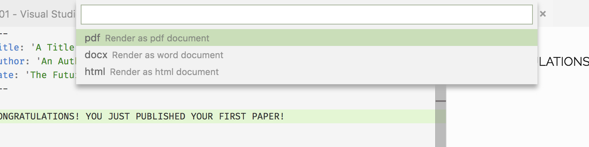
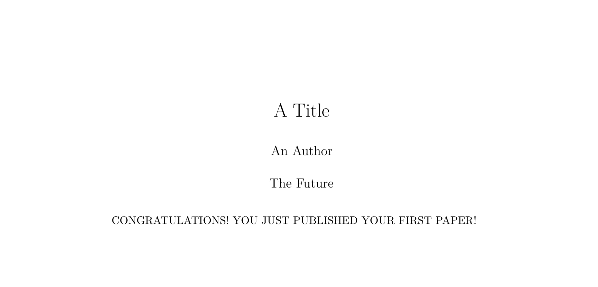

By now, you should have all the necesary packages installed in your computer. The next step is to set up our environment for writting the paper.

You could use any text editor to write your research paper, but in our case we are going to use Visual Studio Code.

## Visual Studio Code


VSC is a boiled down version of Visual Studio that is perfect for writing simple Python and C# scripts, but also amazingly good at Markdown syntax.

> Download Visual Studio Code at: [https://code.visualstudio.com/](https://code.visualstudio.com/)

Other **VERY** good text editors are *SublimeText* and *Atom*, they all have a very similar design and behaviour; and you will find most of the functionality can be extended to your needs via packages/extensions, no matter the text editor you choose.

We will also be making heavy use of VSC's extensions. You can install them directly from visual studio by pressing `CMD+SHIFT+X` on Mac or `CTRL+SHIFT+X` on Windows.

Search and install the following extensions:

* **bibtexLanguage** - by phr0s
* **Markdown All In One** - by Yu Zhang
* **Markdown Footnotes** - by Matt Bierner
* **Markdown Preview Enhanced** - by Yiyi Wang
* **markdownlint** - by David Anson
* **Python** - by Microsoft (this one might come pre-installed)
* **RainbowCSV** - by mechatroner (CSV colouring)
* **vscode-pandoc** - by DougFinke (Research Paper PDF rendering through VSC)
* **vscode-pdf** - by tomoki1207 (Visualize PDF without leaving VSC)

**Optional**, but still recomended:

* **GitLens** - by Eric Amodio (Expands the Git capabilities of VSC)
* **C#** - by Microsoft (if you write C#)
* **$\LaTeX$ Language Support** - by Long Nhat Nguyen

Nice color themes:

* **Gray Matter** - by philipbe (Nice theme colors to write markdown)
* **Light+ Tweaked** - by Per Ragnar Edin
* You can also customize your own!

## Visual Studio Settings

The only thing remaining is to tweak VSC's settings to be able to see all the features of the PDF also in the Preview.

To access VSC's Settings panel, press `CNTRL + ,` on Windows, or `CMD + ,` on Mac.

***If*** you have installed all the required extensions, just copy paste this into the User Settings Panel, just above the last `}`.

```
    "markdown.previewFrontMatter": "show",
    "markdown.extension.toc.levels": "1..2",
    "markdown.extension.toc.githubCompatibility": true,
    "markdown-preview-enhanced.frontMatterRenderingOption": "table",
    "markdown-preview-enhanced.usePandocParser": true,
    "markdown-preview-enhanced.pandocMarkdownFlavor": "markdown+implicit_figures+superscript+subscript+table_captions+definition_lists",
    "markdown-preview-enhanced.pandocArguments": "--filter=pandoc-crossref",
    "markdown-preview-enhanced.previewTheme": "gothic.css",
    "markdown-preview-enhanced.$\LaTeX$Engine": "xelatex",
    "markdown-preview-enhanced.enableScriptExecution": false,
    "markdown-preview-enhanced.mermaidTheme": "mermaid.forest.css",

    "pandoc.pdfOptString": "-N -F pandoc-crossref -F pandoc-citeproc",
```

Some of them are pretty much self-explanatory but others, like `markdown-preview-enhanced.pandocMarkdownFlavor` and `markdown-preview-enhanced.pandocArguments`,
require you to look into the Pandoc library to know the options you can use and what is the correct syntax. For now, just leave them like that, but you can find out everything you need about this in the [Pandoc Manual](http://pandoc.org/MANUAL.html)

## Trying it out

Let's try to publish a simple PDF in Paper format just to make sure everything is working correctly.

In this repository, you will find a folder called `Paper` and inside there should be a file named `00 - Test.md`. 

> Just in case you are wondering: the `.md` extension corresponds to a Markdown text file, you could also use the `.markdown` or even `.txt`, since Markdown is nothing more than plain text after all.

Inside the `00 - Test.md`, the first thing you will find is a code block surrounded by `---`, this is called the ***YAML FrontMatter*** and it is a very important part of your Markdown file: it holds all the information that is not strictly text from your document, but should still go along with the document. 

Such as pdf meta-data, author, publisher, date, title, some Pandoc configuration, etc... You get the idea.

> The YAML Frontmatter has to be always enclosed around `---` in order to work properly.

The test file contains the following YAML Frontmatter:

```YAML
---
title: 'A Title'
author: 'An Author'
date: 'The Future'
---
```

Go ahead and change it for your own personal details, and then press `CNTRL+K` (`CMD+K` for mac) and then, imediately after, press `P`; a menu will pop in the top of your screen giving you an option between `pdf`,`html` or `epub`. Select `pdf` and press `ENTER`.



You will see a temp folder called `text2pdf.-#some-number` (see image below) while the PDF creation is in process, don't worry, it will be deleted once it finishes.


After a couple of secconds, a PDF file named `00 - Test.pdf` should appear on the `Paper` folder. It should look something like this:




## What next?

You can head to the following section: [Part III - Markdown Syntax](./2018-07-23-PartIII-MarkdownSyntax)