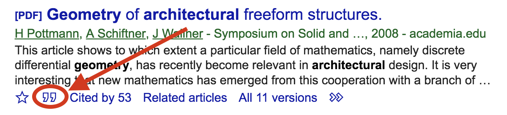

So, now that you have your machine printing a formated PDF out of a simple text file, you might be wondering:

1. ***WHAT*** can I do with this 'Markdown syntax' you talk about so much?
2. ***HOW*** can I combine it with Pandoc to write something more complex than an fancy e-mail?

Let's get to it:

Markdown is based on very simple rules that allow you to concentrate only on writting and structure, without caring about the final appearance of the document.

95% of the time, the PDF output will be exactly what you would expect, with no need for modifications. The other 5% of the time, there is a couple of solutions:

1. you might need to go *under the hood* (using Latex templates) or,

2. add an extra step to the workflow: outputing the file to `.docx` format using a preformatted template, and put the final touches in Word or,

3. if InDesign is your thing, you can also export your document as a `.icml`(InCopy format).

## Simple formating

### Headings

You can do headings with `#`:

```markdown
# Heading 1
## Heading 2
### Heading 3
#### Heading 4
##### Heading 5
###### Heading 6
```

will be rendered like:

> *Heading 1 and 2 are missing because they were messing up the structure, but you get the idea:*  
> 
> ### Heading 3
> #### Heading 4
> ##### Heading 5
> ###### Heading 6

### Lists

#### Bullet lists

```markdown
* Item 1
+ Item 2
  * Nested item 1
    * Nested item 2
- Item 3
```

will be rendered like:

* Item 1
+ Item 2
  * Nested item 1
    - Nested item 2
- Item 3

> Notice that you can use `*`, `+` and `-`, for bullet lists. Although **Pandoc seems to prefer `*`**, so stick to that one.

#### Ordered lists

Ordered/numbered lists use `1.`:

```markdown
1. Item 1
2. Item 2
    1. A nested item
        1.  Another nested item
3. Item 3
```

will be rendered like:

1. Item 1
2. Item 2
    1. A nested item
        1. Another nested item
3. Item 3

### Tables

This is a Markdown  table:

```markdown
| Head 1 | Head 2 | Head 3 |
| ------ | ------ | ------ |
| Item 1 | Item 2 | Item 3 |
| Item 4 | Item 5 | Item 6 |
```

It will look like this:

| Head 1 | Head 2 | Head 3 |
| ------ | ------ | ------ |
| Item 1 | Item 2 | Item 3 |
| Item 4 | Item 5 | Item 6 |

Table captions are not supported by Markdown but Pandoc has a special notation for them. This is a table with a caption.

```markdown
| Head 1 | Head 2 | Head 3 |
| ------ | ------ | ------ |
| Item 1 | Item 2 | Item 3 |
| Item 4 | Item 5 | Item 6 |
: The caption of the table goes here
```

### Images

You can reference an image from anywhere in your system (or the web) using

```markdown

```

Let's try it out grabing the Google logo from the web:

```makrdown

```

The above text will render this:


### Links

Links have exactly the same notation as images but without the exclamation mark at the beginning so writting

```markdown
[LINK_TEXT](WWW.SOME-WEBPAGE.COM)
```

will result in

[LINK_TEXT](WWW.SOME-WEBPAGE.COM)

### Images + Links

You can also nest an image in the `LINK_TEXT` and the whole image will become a link. Let's try it out with the Google logo again:

 ```markdown
 [](http://www.google.com)
 ```

Now clicking the image will take you to Google's website:

 [](http://www.google.com)

> Be carefull with links as they don't play well with printed media, it's better to footnote web addresses so if your document get's printed it will not lose information.

### References

#### Footnotes

You can make a footnote reference using `[^REFERENCE]` ***anywhere*** in the document, with the exception of nested footnotes (footnotes inside a footnote).

Then you can add the footnote text using the same notation in a **new line**, followed by `:` and the text footnote text. Like this:

```markdown
[^REFERENCE]: This text will appear as a numbered footnote in your pdf (and in your Markdown preview ***if*** you installed the Markdown Preview Enhanced extension)
```


> Notice that `REFERENCE` must be a **unique name** It is good practice to give it a *meaningful* name, don't try to number them: Pandoc will take care of the numbering for you.

* The footnote text must have a unique name, but you can reference that name as many times as needed in your document, AND

* You can add as many footnotes as you need, as long as you keep giving them ***unique identifiers***.

#### Bibliography

Very similar to the footnote notation, you can reference a book in  you bibiliography using `[@REFERENCE]`.

The bibliography is a *special* kind of reference. It requires that your references be compiled in a `.bib` file. This is a standard format for scientific references (also, just a text file with fancy format).

The magic about bib files is that you don't have to write any of the information of your papers because *'the internet'* has already done that fore you. It works like this:

You have a bunch of papers you need to reference in your research:

1. Go to [Google Scholar](http://scholar.google.com)
2. Search for your paper name/author...
3. Click on the "Cite" button 
4. A pop-up will appear with some pre-formated text references, **ignore them**
5. Click the BibTeX button in the lower left part and a new window should appear with the reference info in BibTeX format.
6. Copy and paste it to your `.bib` file. If you don't have one, just create a new text file with the `.bib` extension. It should look like this:

```yaml
@inproceedings{pottmann2008geometry,
  title={Geometry of architectural freeform structures.},
  author={Pottmann, Helmut and Schiftner, Alexander and Wallner, Johannes},
  booktitle={Symposium on Solid and Physical Modeling},
  pages={9},
  year={2008}
}
```

The last step is that you need to insert this line anywhere in your ***YAML Frontmatter*** to tell Pandoc where to find you `.bib` file:

```YAML
bibliography: Your_Bib_File.bib
```

> Remember to change `YOUR_BIB_FILE.bib` for the actual name of your file.

Now your YAML Frontmatter should look like this:

```yaml
---
title: 'A Title'
author: 'An Author'
date: 'The Future'
bibliography: Your_Bib_File.bib
---
```

#### Figure/Table/Equation references

References are placed using the format `[@type:label]` anywhere in the text, being `label` the unique name of the desired reference on the format, and `type` the type of reference.

To give a reference code to an image, you use the same notation but with curly brackets `{}`.

You can reference the different types:

* Images: `{#fig:LABEL}`
* Tables: `{#tbl:LABEL}`
* Equations: `{#eq:LABEL}`
* Sections: `{#sec:LABEL}`
  * If sections are added, they will change all the reference names to include their corresponding sections.
* Code blocks: `{#lst:LABEL}`

#### Formulas

LaTeX formulas and reference them can be inserted using `$$` if you want the formula to be centred in it's own line, and `$` if you need it to be inside a paragraph.

For example writting this in a Markdown file:

```latex
$$ f(x) = a^2_i + b^3_j - c $$
```

will be rendered like this:

> $$ f(x) = a^2_i + b^3_j - c $$

And:

```markdown
This is a text with... $f(x) = 4$ ...a formula in it.
```

will be rendered as:

> This is a text with... $f(x) = 4$ ...a formula in it.

I won't go into any more detail but you will find a cheatsheet for $\LaTeX$ in the Symbols.PDF  file found in the 'images' folder.

### Multi-image figures

As a final example of what you can do with Markdown+Pandoc, you can use HTML mixed in Markdown to create a multi-figure, made up of smaller images. All of the images have their own reference, and the whole figure has it's reference too!

```html
<div id="fig:multiFigure">
{#fig:figa width=30%}
{#fig:figb width=60%}
{#fig:figc width=10%}

Difference between width-settings, nocaption option, etc... [@Fig:multiFigure] is a full figure reference, but you can also reference just one of the images, like [@Fig:figa;[@Fig:figb;[@Fig:figc].
</div>
```

This does't render nicely on html, but should look like this on your paper (please forgive the mismatched heights on the pictures...it's terrible...I know...)

